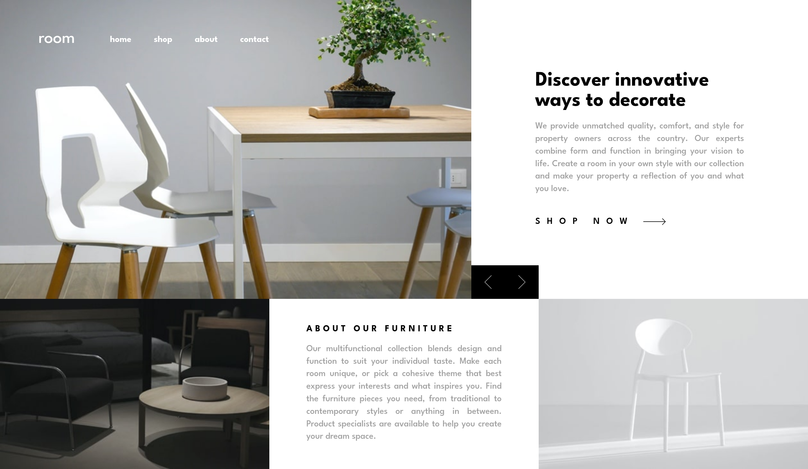

# Frontend Mentor - Room homepage solution

This is a solution to the [Room homepage challenge on Frontend Mentor](https://www.frontendmentor.io/challenges/room-homepage-BtdBY_ENq). Frontend Mentor challenges help you improve your coding skills by building realistic projects.

## Table of contents

-   [Overview](#overview)
    -   [The challenge](#the-challenge)
    -   [Screenshot](#screenshot)
    -   [Links](#links)
-   [My process](#my-process)
    -   [Built with](#built-with)
    -   [What I learned](#what-i-learned)
    -   [Useful resources](#useful-resources)

## Overview

### The challenge

Users should be able to:

-   View the optimal layout for the site depending on their device's screen size
-   See hover states for all interactive elements on the page
-   Navigate the slider using either their mouse/trackpad or keyboard

### Screenshot

### Links

-   Solution URL: [Room Homepage](https://www.frontendmentor.io/solutions/responsive-room-homepage-using-htmlscss-emiqACpUXX)
-   Live Site URL: [Room Homepage](https://fem-room-homepage-nu.vercel.app/)

## My process

### Built with

-   Semantic HTML5 markup
-   CSS custom properties
-   Flexbox
-   CSS Grid
-   Mobile-first workflow
-   [Vite](https://vite.dev/) - Build Tool

### What I learned

-   Polished grid layout basics
-   Polished building a gallery slider

### Useful resources

-   [CSS Tricks Grid Guide](https://css-tricks.com/snippets/css/complete-guide-grid/) - This helped me for layout positioning.
